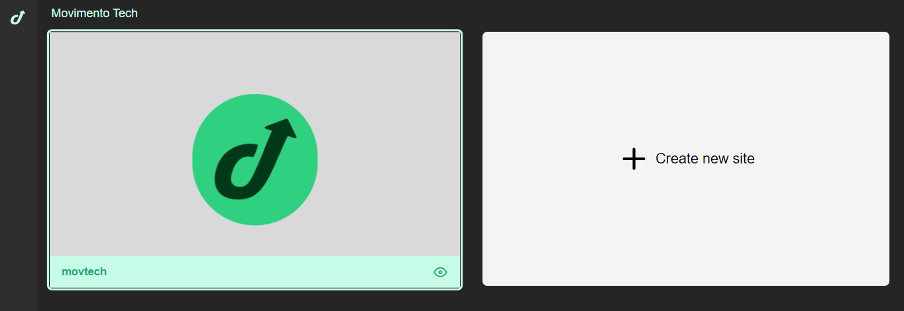
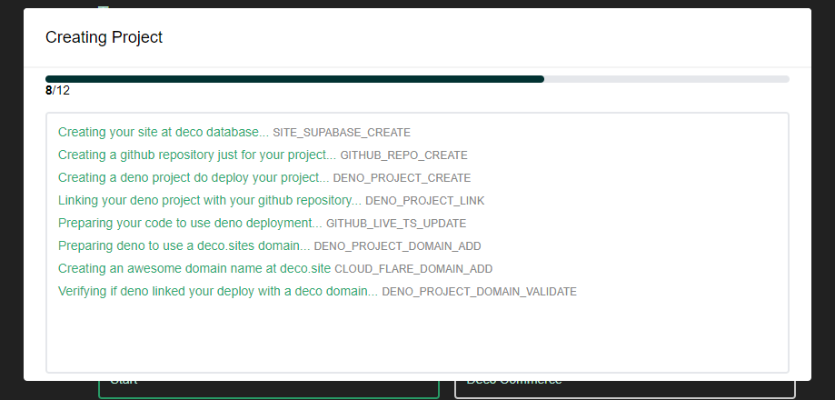
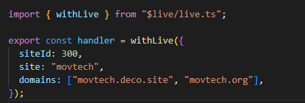
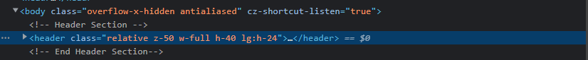
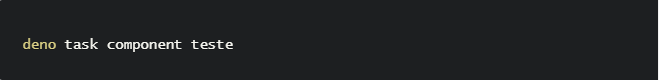
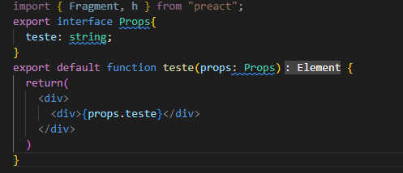
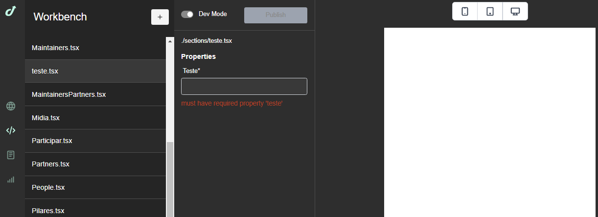
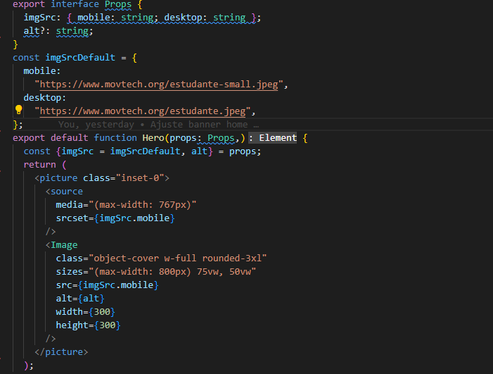
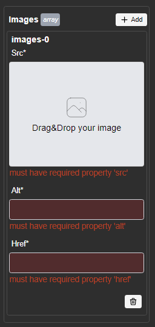
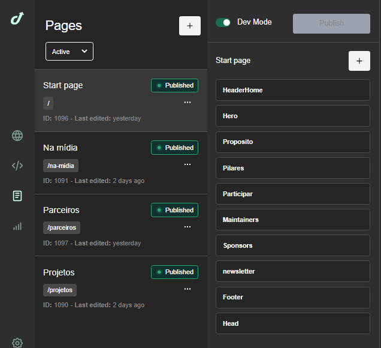

# Setup - Deco

## Introdução

A seguinte documentação tem como objetivo descrever os passos de desenvolvimento para que seja desenvolvida uma página ou um conjunto de páginas Front-end dentro da plataforma Deco.

A plataforma Deco é uma ferramenta voltada para o desenvolvimento e hospedagem de páginas em diversas plataformas, tanto pensando no desenvolvimento de front-end de forma pura quanto dentro de plataformas que tenham as API 's disponíveis através da tecnologia headless.

A Deco é versátil e estável, sempre buscando agregar em qualquer tecnologia, unificando ferramentas e permitindo não só uma centralização de conteúdos, mas também agregando uma interface amigável para o usuário.

## Pré-requisitos

Para o desenvolvimento em Deco precisaremos de algumas ferramentas que nos permitirão a criação da demanda especificada. Vamos à elas:

- Primeiramente deve ser feita a instalação no Deno seguindo esta [documentação](https://github.com/deco-cx/blog/blob/main/index.md). Nela encontramos diversas possibilidades de instalação. O Deno permitirá mais performance e nos trará todas as dependências necessárias para desenvolvermos em Deco;

- Uma ferramenta de hospedagem também é necessária, como gitlab, github ou Bitbucket, com as permissões necessárias para edição. A seguir deve ser feita a clonagem dos arquivos no repositório;

- Depois faça login no [deco.cx/live](https://deco.cx/login?returnUrl=%2Flive);

- Além disso, é necessário ter instalado no computador a IDE de sua preferência, Node (em qualquer versão), Git (em qualquer versão) e NPM (ou o controlador de pacotes Node de sua preferência).

## Iniciando

Acesse [deco.cx/live](https://deco.cx/login?returnUrl=%2Flive) e inicie um novo projeto.

São pedidas algumas informações básicas. Para um projeto personalizado, escolha o template “Start”. Ao clicar em “Create”, todo seu projeto já terá seu setup efetuado automaticamente.

Sobre o uso da interface Deco, consulte esta [documentação](https://deco.fibery.io/@public/Documenta%C3%A7%C3%A3o_deco/Guias-174).

## Conectando sua aplicação à Deco

Para iniciarmos o projeto precisamos "linkar" com o ambiente da DECO. Para isso, precisamos ajustar algumas configurações dentro do código. Alterando as informações no arquivo Middleware.

## Criação das sections - Deco
Você pode criar as sections da seguinte forma:

Copie a estrutura que deseja componentizar em seu projeto

Com a estrutura copiada em seu clipboard vá até seu terminal e use o seguinte comando:

deno task component (e o nome que deseja no component)

Dessa forma o arquivo já vem formatado e com algumas pré- correções para evitar erros.

## Utilizando as props - Deco

Utilizando a declaração interface Props, você pode componentizar elementos para que o conteúdo possa ser customizado pelo admin.
Podemos colocar as props em qualquer página criada, apenas declarando.

exemplo:

Dessa forma o que for descrito como Props será enviado ao painel da Deco.

E assim o cliente final consegue alterar as informações pelo painel da Deco sem precisar de um desenvolvedor. 

## Componente de imagem - Deco
Usando esse componente pode-se trocar as imagens pelo painel da deco.

No código adicionamos essa estrutura.

Nesse bloco podemos adicionar as imagens tanto para desktop como para mobile. Apenas trocando a URL.

No painel podemos alterar e adicionar as imagens para todos os tipos de dispositivos. 
Subindo uma imagem via painel ou apenas alterando a URL da imagem.

## Páginas - Deco

As páginas na plataforma da Deco são criadas  via o painel.
Você pode alinhar as camadas das sections e popula-las com conteúdo. Acessando a estrutura PAGES.

Dentro do painel você pode adicionar quantas páginas for preciso. Apenas clicando no botão + .

Adicionando as informações.

  - Nome: **Nome da Página.**
  - Path: **URL da página**
  - Copy Sections From: **Você pode copiar a estrutura de uma página existente.**

